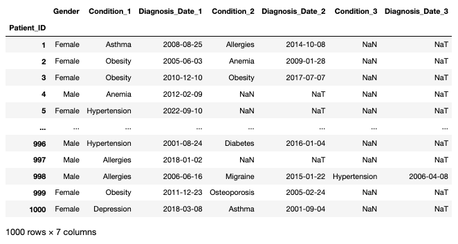

# WidetoLong cleaner + pivot (Python)
A quick block of Pandas code that re-formats wide format data into a pivot table. Saving here for future use.

## Overview
I'm currently working with health data storage software that can generate customised excel reports. When patient data is returned on fields where the patient has more than one entry, it adds columns in wide format, making aggregation difficult.



This code uses ```pd.widetolong``` to melt the wide data, and then pivots it.

Part I: generates synthetic health data to replicate the format I am encountering. The 'dummy' use case has been invented for illustrative purposes.

Part II: cleans the data and writes it to excel.